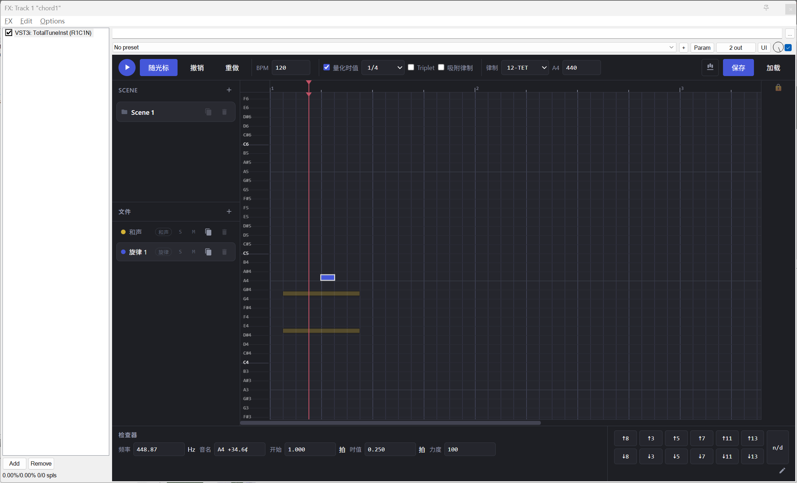

# TotalTune

A just-intonation MPE MIDI editor — JUCE + WebView plugin.

Harmony × Melody · Any tuning system · Real-time MPE output.



## What is it

TotalTune is a **MIDI effect / instrument plugin** (VST3 / AU / Standalone) built
around a MPE MIDI editor for "just-intonation harmony + any-tuning melody":

- **Harmony layer**: build chords from just-intonation ratios, notes carry
  precise cent offsets
- **Melody layer**: write melodies in any tuning system (12-TET / JI /
  custom ratio tables)
- **MPE output**: playback streams MPE MIDI in real time (member ch1–15);
  downstream instruments play it directly
- **Two flavors** from the same source:
  - `TotalTune` (MIDI effect — put it on the MIDI chain before an instrument)
  - `TotalTuneInst` (VST3 instrument with a built-in SimpleSynth audio output)

The UI is HTML/CSS/JS hosted in a JUCE WebView (WebView2 with statically
linked Loader on Windows, WKWebView on macOS), talking to the C++ side over a
bidirectional bridge.

## Build

### Prerequisites

- CMake ≥ 3.22
- A C++17 compiler (Windows: MSVC / VS 2022; macOS: Xcode)
- JUCE ≥ 8 sources (local path, or let CMake fetch it)

### Steps

```bash
# Option 1: use a local JUCE
cmake -B build -DJUCE_ROOT="E:/JUCE"
cmake --build build --config Release

# Option 2: fetch JUCE 8.0.5 from GitHub automatically
cmake -B build -DTOTALTUNE_FETCH_JUCE=ON
cmake --build build --config Release
```

On macOS add `-G Xcode`:

```bash
cmake -B build -G Xcode -DJUCE_ROOT=/path/to/JUCE
cmake --build build --config Release
```

### Artifacts

| Target | Path |
|--------|------|
| TotalTune.vst3 (MIDI effect) | `build/TotalTune_artefacts/Release/VST3/` |
| TotalTuneInst.vst3 (instrument) | `build/TotalTuneInst_artefacts/Release/VST3/` |
| TotalTune.exe (Standalone) | `build/TotalTune_artefacts/Release/Standalone/` |
| AU (macOS only) | `build/TotalTune_artefacts/Release/AU/` |

## Usage

See [MANUAL.md](MANUAL.md) for the full manual (playback, editing,
shortcuts, scenes, tuning, save/load).

### Quick start

1. Load `TotalTune` (MIDI effect) or `TotalTuneInst` (instrument) in your DAW
2. Open the editor, click `+` in the sidebar to create a Scene →
   fill in the harmony → add a melody
3. Pick a tuning in the top bar (12-TET / JI / custom), use the interval
   buttons in the bottom-right to build harmony
4. Hit Space to play — MPE MIDI streams to the host in real time
5. Drag a file item out to export an MPE MIDI file (chordN / mdN)

## Project layout

```
TotalTune-Webui/
├── CMakeLists.txt          # dual-target build (MIDI effect + instrument)
├── src/                    # C++ side (JUCE plugin shell + WebView host)
│   ├── TotalTuneProcessor.h/.cpp   # audio/MIDI processing, state persistence
│   └── TotalTuneEditor.h/.cpp     # WebView editor, bridge, temp files
├── ui_totaltune/           # web UI (packed into BinaryData)
│   ├── index.html
│   ├── css/style.css
│   └── js/                 # model / tuning / editor / manager / app /
│                           # bridge / audio / mpe_export / live_export ...
├── prototype/GoodJust/     # early pure-web prototype (opens in a browser)
└── MANUAL.md
```

## Technical notes

- **WebView2 static linking** (Windows only):
  `JUCE_USE_WIN_WEBVIEW2_WITH_STATIC_LINKING=1` — no separate WebView2 Loader
  install needed on user machines
- **Temp directory**: runtime temp files go to the system temp folder
  (`%TEMP%\TotalTune` on Windows — user-level, no admin rights needed)
- **JUCE 8/9 compatible**: `LANGUAGES C CXX` (JUCE 9 requires a C compiler)
- **.rc rebuild quirk**: `file(REMOVE ..._resources.rc)` at configure time
  forces VERSIONINFO regeneration (JUCE's custom command DEPENDS is missing
  Info.txt)

## License

Copyright (c) 2026 R1C1N

This project is licensed under the **GNU General Public License v3.0**
(GPL-3.0). See the [LICENSE](LICENSE) file for details, or visit
<https://www.gnu.org/licenses/gpl-3.0.html>.
